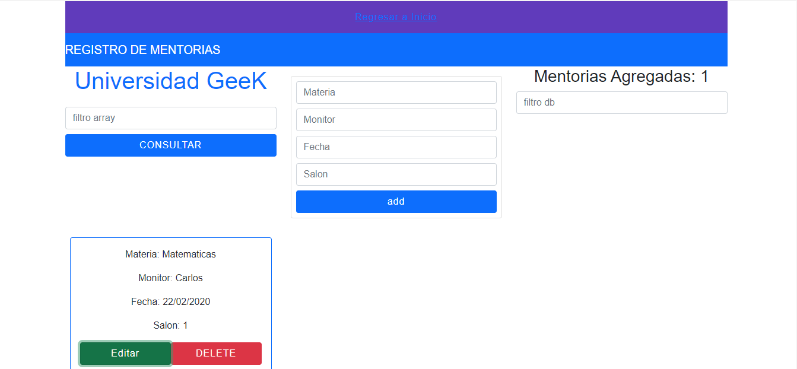

# Programa de Mentorias - Prueba Tecnica

[Demo](https://reto-ofjijdxzd-lilop243.vercel.app/) | [Demo](https://reto-ofjijdxzd-lilop243.vercel.app/)

## Informacíon 

Open  Programa sistematizado para mentorias .

## Desarrollado con 
* Firebase
* React
* Bootstrap

## Descargar el repositorio

$ git clone https://github.com/Lilop243/reto.git
Instalar las dependecias

### `npm i`

$ npm install

## Ejecutar servidor de desarrollo

### `npm start`

## YARN

### `yarn start`

## Cambiar direccíon URL con la api
